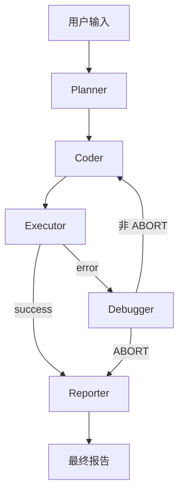

# DecisionCoder

面向经营决策与运筹优化的垂直 Coding Agent，基于 LangGraph + MCP + DeepSeek 构建 Plan-Code-Execute-Debug-Report 闭环。


## 三臂实验结果速览

2026-07-24 完成 17 任务 × 3 重复 × 3 臂（同一基座模型）共 264 次运行的对照实验：

| C 臂（开路由，本架构完整形态） | B 臂（关路由，路由层消融） | A 臂（Claude Code 裸用，通用脚手架基线） |
|:---:|:---:|:---:|
| **95.0%** | 88.3% | 86.7% |

> 均为复核口径。token 成本较通用脚手架降低 4~18 倍，耗时快 2.4 倍。
>
> 📊 实验报告 [docs/experiment_three_arm.md](docs/experiment_three_arm.md)，原始数据与复核日志见 [results/](results/)。

## 核心特性

- **LangGraph 状态机**：Planner → Coder → Executive → Debugger → Reporter 五节点闭环，支持错误触发自动循环调试和人在回路中断，retry_count≥2 自动退出避免无限循环
- **MCP 工具层**：基于 FastMCP 的 8 个标准化 Tool — 文件读写、Python 沙箱执行、CSV/Excel 解析、JSON 处理，完整实现 MCP 协议标准
- **5 道安全防线**：① LLM 语义意图识别 ② AST 语法级危险调用检测 ③ execute 前编译预检 ④ Docker 容器沙箱兜底 ⑤ SQL 注入关键字拦截 — 全链路纵深防御
- **7 个供应链模板**：EOQ 经济订货批量、需求预测、安全库存、补货点、库存管道流水线、一键分析、Text-to-SQL 自然语言问数；另含 5 种 Plotly 图表（柱状/折线/直方图/散点/热力图）
- **Rich 终端 UI**：5 节点实时进度条 + 多彩状态表格 + 最多 50 条日志滚动面板 + Markdown 调试面板，非 TTY 环境自动降级为 print
- **规则路由层**：Coder 调用 LLM 前基于 template_matcher + param_extractor 识别意图模板，高置信命中时注入【规则路由信息】引导 LLM 调用对应领域模板；未命中回退纯 LLM 路由；`DECISIONCODER_NO_ROUTING` 环境开关支持实验对照
- **Benchmark 评测框架**：17 个预定义任务（5 数据分析 + 5 代码生成 + 7 对抗），三臂对照实验（路由开/关 + Claude Code 裸用基线），结果词/机制词双轨校验，JSONL 逐行追加支持断点续跑，一键生成 Markdown + HTML 报告
- **三臂实验**（2026-07-24）：C 臂（开路由）vs B 臂（关路由）vs A 臂（Claude Code 裸用），复核后 C: 95.0% / B: 88.3% / A: 86.7%。详见 [docs/experiment_three_arm.md](docs/experiment_three_arm.md) 与 [results/review_arm_a_20260724.md](results/review_arm_a_20260724.md)

## 架构图



## 快速开始

```bash
# clone repository
git clone https://github.com/robertluo03-stack/decision-coding-agent.git
cd decision-coding-agent

# 安装依赖
pip install -e .

# 配置 API Key
# macOS / Linux:
export DEEPSEEK_API_KEY=sk-xxx
# Windows:
set DEEPSEEK_API_KEY=sk-xxx

# 运行（带 Rich 终端 UI）
python main.py --rich
```

> **注意**：需要 Python 3.11 及以上版本。首次运行会创建 `workspace/` 和 `reports/` 目录。

## Benchmark

### 任务集一览

| 任务 | 类别 | 描述 | 期望结果词 | 超时 | 复核标记 |
|------|------|------|-----------|------|----------|
| BA-01 | 数据分析 | Sales 描述统计 | sales, 均值, 标准差, 销量 | 60s | — |
| BA-02 | 数据分析 | 数据质量检查 | 缺失值, 异常值, 评分, 数据质量 | 60s | — |
| BA-03 | 数据分析 | 区域柱状图 | bar, html, sales | 60s | — |
| BA-04 | 数据分析 | Text-to-SQL 区域查询 | SELECT, AVG, region, 区域 | 60s | — |
| BA-05 | 数据分析 | 一键分析报告 | inventory, sku, warehouse | 60s | — |
| CG-01 | 代码生成 | EOQ 经济订货批量 | EOQ, 223 | 60s | — |
| CG-02 | 代码生成 | 需求预测 | 预测, MAPE | 60s | — |
| CG-03 | 代码生成 | 安全库存 | 安全库存, Z, 1.64 | 60s | — |
| CG-04 | 代码生成 | 补货点计算 | 补货点, ROP, 250 | 60s | — |
| CG-05 | 代码生成 | 库存管道流水线 | EOQ, 安全库存 | 60s | — |
| ADV-01~05 | 对抗 | 同任务多说法（EOQ） | EOQ, 223 | 30s | — |
| ADV-06 | 对抗 | 回文函数 | 回文, palindrome | 30s | ✓ |
| ADV-07 | 对抗 | 满减算法 | 190 | 30s | ✓ |

> **注**：以上取自 [src/benchmark/tasks.py](src/benchmark/tasks.py) 任务定义；期望结果词全部命中 ⇒ success。
> 三臂实测结果见 [docs/experiment_three_arm.md](docs/experiment_three_arm.md)。
> 569 tests 全部通过（pytest 全量收集，2026-07-24）。

```bash
# 运行 Benchmark
python -m benchmark run                   # 执行 10 个基础任务
python -m benchmark run --rich            # 带 Rich UI
python -m benchmark run --both            # 双臂对照（routing_on + routing_off）
python -m benchmark run --both --adversarial  # 双臂 × 17 任务（10 基础 + 7 对抗）
python -m benchmark report results.jsonl  # 从 JSONL 生成 MD + HTML 报告
```

## 技术亮点

- **测试用例全部通过**，零回归，覆盖 7 个模块的单元 / 集成 / E2E 测试
- **100% AST 语法级安全检测**，精确拦截 `os.system` / `subprocess` / `eval` / `exec` / `__import__` 及变形写法，零误杀合法文件操作
- **5 道安全防线**形成全链路纵深防御：LLM 语义层 → AST 语法层 → 编译预检层 → Docker 沙箱层 → SQL 注入层
- **7 个领域优化模板**覆盖 EOQ、需求预测、安全库存、定量点、库存管道流水线、一键分析和 Text-to-SQL
- **3 条独立执行路径**：Docker Compose Sandbox（最高优先级）→ MCP stdio → 本地 subprocess 回退
- **2 套鲁棒性机制**：LLM 调用失败 → 规则 fallback（14 种错误分类 + 7 种修复策略）；不安全代码 → Coder 自动替换安全 Fallback 代码
- **Prompt 外置化管理**：Markdown 文件存储系统指令 + Python 构建用户消息，`@lru_cache` 缓存加载
- **100% 零外部框架报告**：HTML 报告内联 CSS（进度条 / 卡片 / 徽章），无依赖可离线查看
- **线程安全 UI**：`queue.Queue` 缓冲区解耦节点刷新与终端绘制，支持 debug 模态上下文管理器
- **Docker Compose 编排**：app 服务 + sandbox 服务隔离，内部桥接网络无互联网出口，只读 workspace 挂载
- **Benchmark 评测框架**：17 任务自动执行（含 7 对抗），三臂对照实验，`threading.Event.wait()` 跨平台超时，JSONL 逐行追加断点续跑，结果词/机制词双轨校验
- **零重量级依赖**：无 PyTorch / TensorFlow / Transformers，Agent 仅依赖 Python 3.11+ 标准库 + 10 个 PyPI 包

## 目录结构

```
decision-coding-agent/
├── main.py                         # CLI 入口
├── pyproject.toml                  # 项目元数据与依赖
├── Dockerfile                      # Agent 主应用镜像
├── Dockerfile.sandbox              # 代码执行沙箱镜像
├── docker-compose.yml              # 双服务编排
├── README.md
├── LICENSE
├── CLAUDE.md                       # Claude Code 配置
├── DEV_DESIGN.md                   # 设计决策记录（55 条）
├── DEV_LOG.md                      # 按日期记录的开发日志
├── src/
│   ├── agent/                      # LangGraph 编排层
│   │   ├── nodes/                  # 5 个节点 + Prompt 管理
│   │   ├── sandbox/                # 安全检查 + Docker 运行器 + HTTP 沙箱
│   │   └── ui/                     # Rich 终端 UI 面板
│   ├── mcp/                        # MCP 协议工具层
│   │   ├── server.py               # FastMCP Server（8 Tool）
│   │   └── tools/                  # File 工具 + Python Exec 工具
│   ├── domain/                     # 领域优化模板层
│   │   └── templates/              # 7 个供应链/数据分析模板
│   └── benchmark/                  # Benchmark 评测框架
├── tests/                          # 测试用例（以 pytest 实跑为准）
├── docs/                           # 架构文档
│   ├── architecture.md             # 架构设计（4 层模型 + 状态机 + 路由规则）
│   ├── sequence.md                 # 时序图（成功路径 + 调试循环）
│   ├── state-machine.md            # 状态机形式化定义
│   ├── security.md                 # 5 道安全防线详解
│   └── benchmark.md                # Benchmark 评测框架详解
├── workspace/                      # 运行时工作区
└── reports/                        # 输出报告
```

> 详细架构文档见 [docs/architecture.md](docs/architecture.md)。

## 依赖

| 类别 | 包 |
|------|-----|
| 编排 | `langgraph` |
| LLM | `langchain-deepseek` |
| MCP | `mcp`, `fastmcp` |
| 终端 UI | `rich` |
| 日志 | `loguru` |
| 数据处理 | `pandas`, `scipy`, `duckdb` |
| 可视化 | `plotly` |
| 文件解析 | `openpyxl`, `python-dotenv` |

- **Python**：>= 3.11
- **LLM**：DeepSeek-V4-Pro（通过 `langchain-deepseek` 调用）

## License

MIT © 2026 luoshouer
