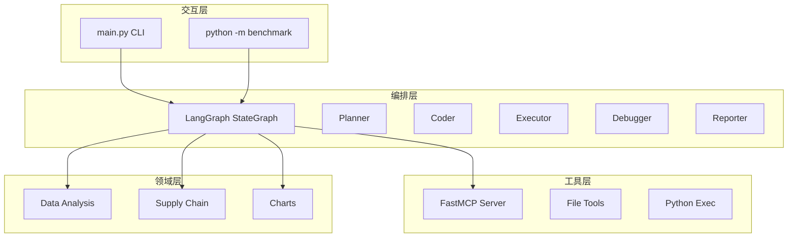
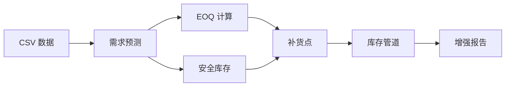

# DecisionCoder 架构设计

> 深度阅读材料 — 快速概览请见 [README.md](../README.md)。
> 相关文档：[顺序图](sequence.md) · [状态机](state-machine.md) · [安全体系](security.md) · [Benchmark](benchmark.md)

## 整体架构

DecisionCoder 采用 **4 层分层架构**：交互层负责用户输入输出，编排层管理 Agent 状态流转，工具层提供标准化 MCP 接口，领域层封装运筹优化模板。



**各层职责**：

| 层 | 位置 | 职责 | 关键组件 |
|---|------|------|---------|
| **交互层** | `main.py` / `benchmark/` | 接收用户输入，展示执行结果 | CLI 交互式对话、Rich 终端 UI、Benchmark 命令行 |
| **编排层** | `src/agent/` | 管理 Plan-Code-Execute-Debug-Report 状态流转 | LangGraph StateGraph + 5 节点 + 2 条件路由 |
| **工具层** | `src/mcp/` | 提供标准化的文件读写、Python 执行能力 | FastMCP Server（8 个 Tool）+ stdio transport |
| **领域层** | `src/domain/` | 封装供应链优化、数据分析的领域知识 | 7 个预定义模板 + 匹配器 + 参数提取器 |

## 状态机设计

### AgentState 字段定义

所有节点共享一个 `AgentState`（TypedDict），节点只返回 partial update，LangGraph 自动合并。详见 [state.py](../src/agent/state.py)。

| 字段 | 类型 | 说明 | 示例 |
|------|------|------|------|
| `user_query` | `str` | 用户原始自然语言需求 | "分析 sales.csv 并画图" |
| `workspace_path` | `str` | 工作区绝对路径 | "/app/workspace" |
| `plan` | `List[str]` | Planner 输出的执行步骤 | ["读取数据", "质量检查", ...] |
| `generated_code` | `str` | Coder 生成的 Python 代码 | "import pandas as pd\\n..." |
| `file_path` | `Optional[str]` | Executor 输出的临时文件路径 | "/app/workspace/src/_dc_exec_12345.py" |
| `execution_result` | `Optional[str]` | stdout 内容 | "hello\\n" |
| `error` | `Optional[str]` | stderr 或异常信息 | "NameError: name 'x' is not defined" |
| `retry_count` | `int` | 当前重试次数（初始 0） | 0 → 1 → 2（上限） |
| `human_feedback` | `Optional[str]` | 人在回路反馈 | "AI_FIX:...", "USER_FIX:...", "SKIP", "ABORT" |
| `final_report` | `Optional[str]` | Reporter 输出的 Markdown 报告 | "## 执行报告\\n..." |

### 关键约束

- **`retry_count >= 2`** → Debugger 入口直接返回 ABORT，不调用 LLM，强制终止循环
- **`human_feedback == "ABORT"`** → Reporter 生成 `fail_*.md` 而非 `report_*.md`
- **Executor** 执行时注入 `PYTHONPATH` 指向项目根目录，使 Coder 生成的 `from src.domain.xxx import ...` 可用

### 状态流转

```
Planner → Coder → Executor → [route_after_executor]
                                ├─ error 且非 ABORT → Debugger → [route_after_debugger]
                                │                              ├─ 非 ABORT → Coder（循环）
                                │                              └─ ABORT → Reporter
                                └─ 无 error 或 ABORT → Reporter → END
```

### 条件路由规则

两个路由函数定义在 [graph.py](../src/agent/graph.py)：

| 路由函数 | 条件 | 返回值 | 目标节点 |
|----------|------|--------|---------|
| `route_after_executor` | `error` 存在且 `human_feedback != "ABORT"` | `"debug"` | Debugger |
| `route_after_executor` | 否则（无 error 或已 ABORT） | `"report"` | Reporter |
| `route_after_debugger` | `human_feedback == "ABORT"` | `"report"` | Reporter |
| `route_after_debugger` | 否则 | `"code"` | Coder（循环） |

## 安全纵深防御

DecisionCoder 实现 **5 道纵深防线**，从 LLM 语义层到 OS 容器层逐层收紧。详细分析见 [security.md](security.md)。

| 防线 | 位置 | 文件 | 机制 | 拦截示例 |
|------|------|------|------|---------|
| **第零道** | Planner | [planner.py](../src/agent/nodes/planner.py) | LLM 语义识别 | "执行 rm -rf /" → 拒绝生成计划 |
| **第一道** | Coder | [coder.py](../src/agent/nodes/coder.py) | AST 语法级危险调用检测 | `__import__('os').system('ls')` → 触发 fallback |
| **第二道** | Executor | [executor.py](../src/agent/nodes/executor.py) | 执行前空代码检查 + AST 再检 + compile() | 危险代码再次拦截，SyntaxError 提前捕获 |
| **第三道** | DockerRunner | [docker_runner.py](../src/agent/sandbox/docker_runner.py) | AST 兜底检查（落地前最后一关） | 变形写法全部拦截 |
| **第四道** | Docker 容器 | Dockerfile | 资源限制 + 网络隔离 + 只读文件系统 | `--memory=512m --network none --read-only` |

另有 **SQL 安全防线**（Text-to-SQL）：LLM 层约束 + 12 种危险关键字正则 + SELECT-only 前缀检查。

## 领域模板层

DecisionCoder 的 **核心差异化能力** — 7 个预定义模板覆盖供应链优化和数据分析的主要场景。详见 [domain/__init__.py](../src/domain/__init__.py)。

| # | 模板 | 文件 | 功能 | 典型输入 | 输出 |
|---|------|------|------|---------|------|
| 1 | EOQ | `inventory_eoq.py` | 经济订货批量计算 | 年需求/订货成本/持有成本 | EOQ 值 + 分析 |
| 2 | 需求预测 | `demand_forecast.py` | 4 种预测算法 + 自动选择 | 历史序列 + 预测期数 | 预测值 + MAE/RMSE/MAPE |
| 3 | 安全库存 | `safety_stock.py` | 3 种波动场景 + Z-score | 均需求/标准差/提前期/服务水平 | 安全库存量 + 公式 |
| 4 | 补货点 | `reorder_point.py` | ROP 计算 + 策略建议 | 需求/提前期/安全库存/EOQ | ROP + 补货策略 |
| 5 | 一键分析 | `data_analysis.py` | 7 步端到端分析流水线 | CSV 文件路径 | 5 章节 Markdown 报告 |
| 6 | Text-to-SQL | `text_to_sql.py` | NL → SQL → DuckDB 执行 | 自然语言 + CSV | SQL + 查询结果 |
| 7 | 库存管道 | `inventory_pipeline.py` | 8 步库存优化闭环 | CSV + 参数 | 10 章节增强报告 |

### 模板协作关系

供应链优化三件套的协作流程 — EOQ 的输出作为补货点的输入：



## Benchmark 框架

自动化评测框架，10 个预定义任务，支持断点续跑和报告生成。详细分析见 [benchmark.md](benchmark.md)。

### 任务分类

| 类别 | 任务 | 说明 |
|------|------|------|
| **数据分析** | BA-01 ~ BA-05 | 统计计算、质量检查、图表生成、Text-to-SQL、一键分析 |
| **代码生成** | CG-01 ~ CG-05 | EOQ、需求预测、安全库存、补货点、库存管道 |

### 核心指标

| 指标 | 说明 | 计算方式 |
|------|------|---------|
| 完成率 | 任务未超时且返回结果的比例 | `completed / total` |
| 成功率 | 完成的任务中通过验证的比例 | `success / completed` |
| 平均重试 | 所有任务 retry_count 的平均值 | `sum(retry_count) / total` |
| 平均耗时 | 所有任务执行时长的平均值 | `sum(elapsed) / total` |

### 报告格式

```bash
python -m benchmark run                    # 运行全部 10 任务 → JSONL 输出
python -m benchmark run --rich             # 带 Rich 终端 UI
python -m benchmark report results.jsonl   # JSONL → Markdown + HTML 报告
```

HTML 报告零外部依赖：进度条、卡片、徽章全部内联 CSS，可离线查看。

---

> **下一步**：阅读 [顺序图](sequence.md) 了解成功路径与调试循环的时序差异，或阅读 [状态机](state-machine.md) 查看状态转换的形式化定义。
