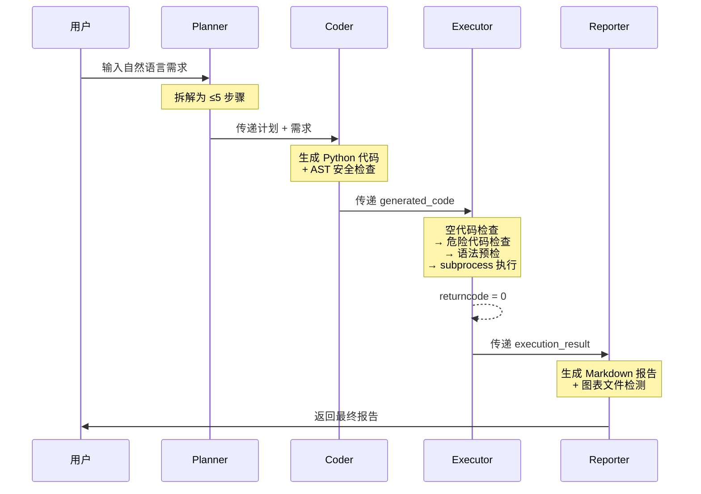
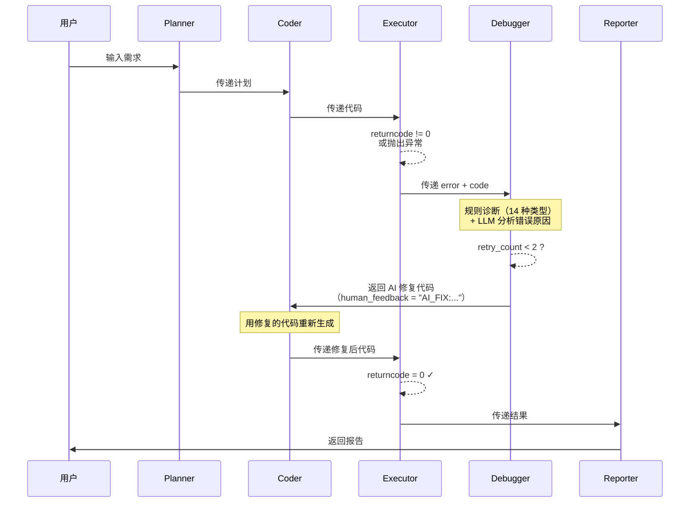

# DecisionCoder 时序图

> 展示 Agent 执行流程中节点间的消息传递时序。架构概览见 [architecture.md](architecture.md)。

## 图 1：成功路径

用户发起一次完整请求，代码正确执行无错误，直接生成最终报告。

**说明**：这是最优路径，Planner → Coder → Executor → Reporter 一条直线。若 Coder 生成的代码被 AST 拦截，会触发回退安全代码（不进入 Debugger 循环）。

## 图 2：调试循环路径

代码执行出错时触发 Debugger 分析，AI 生成修复代码后重新执行。最多循环 2 次（`retry_count` 上限）。

**说明**：`retry_count` 从 0 开始，每次进入 Debugger 自动 +1。当 `retry_count >= 2` 时，Debugger 不调用 LLM 直接返回 `ABORT`，状态机进入 Reporter 生成 `fail_*.md`。

## ABORT 触发条件

以下任一条件满足时，流程进入 ABORT（强制终止）路径：

1. **`retry_count >= 2`** — 达到最大重试上限，Debugger 自动返回 ABORT
2. **用户选择选项 4（中止）** — `human_feedback = "ABORT"`
3. **用户选择选项 3（跳过）** — `human_feedback = "SKIP"`（不触发 Debugger，但 reporter 处理）

ABORT 后 Reporter 生成 `fail_*.md` 而非 `report_*.md`，文件名格式为 `fail_{query摘要}_{timestamp}.md`。

---

> **下一步**：阅读 [state-machine.md](state-machine.md) 查看状态转换的形式化状态图。
