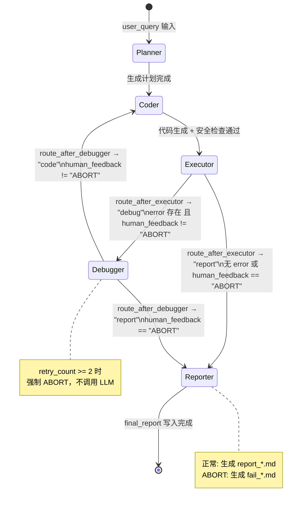

# DecisionCoder 状态机

> LangGraph StateGraph 的状态转换形式化定义。时序流程见 [sequence.md](sequence.md)。

## 状态定义

5 个功能节点 + 1 个终态，全部由 LangGraph StateGraph 管理。

## 转换表

| 源状态 | 目标状态 | 路由函数 | 条件 |
|--------|---------|----------|------|
| `Planner` | `Coder` | —（固定边） | 计划生成完成 |
| `Coder` | `Executor` | —（固定边） | 代码生成 + 安全检查通过 |
| `Executor` | `Debugger` | `route_after_executor` | `error is not None` 且 `human_feedback != "ABORT"` |
| `Executor` | `Reporter` | `route_after_executor` | `error is None` 或 `human_feedback == "ABORT"` |
| `Debugger` | `Coder` | `route_after_debugger` | `human_feedback != "ABORT"`（修复后循环） |
| `Debugger` | `Reporter` | `route_after_debugger` | `human_feedback == "ABORT"`（中止） |
| `Reporter` | `END` | —（固定边） | 报告写入完成 |

## 状态生命周期

### Planner

- **进入**：`user_query` 有值
- **操作**：调用 DeepSeek API（temp=0.3）拆解需求为 ≤5 步骤
- **输出**：`state["plan"]`
- **失败**：返回 `["错误：Planner 调用失败"]`

### Coder

- **进入**：`plan` 有值
- **操作**：根据意图选择模板 → 调用 DeepSeek API 生成代码 → AST 安全检查
- **输出**：`state["generated_code"]`
- **失败**：生成安全回退代码 `_generate_fallback_code()`

### Executor

- **进入**：`generated_code` 有值
- **操作**：空代码检查 → 危险代码检查(AST) → 语法预检(compile) → 执行
- **执行路径（按优先级）**：
  1. Compose Sandbox（`SANDBOX_URL` / `USE_COMPOSE`）
  2. MCP Client（`USE_MCP=true`）
  3. subprocess（默认）
- **输出**：`state["execution_result"]` / `state["error"]` / `state["file_path"]`
- **失败**：设置 `error` 字段触发路由

### Debugger

- **进入**：`error` 有值 且 `human_feedback != "ABORT"`
- **前置检查**：`retry_count >= 2` → 直接返回 ABORT（不调用 LLM）
- **操作**：14 种规则诊断 → LLM 分析 → 生成修复方案
- **输出**：`state["human_feedback"]` / `state["retry_count"] += 1`
- **失败**：fallback 到 `_fix_by_rule()` 规则修复

### Reporter

- **进入**：Executor 无 error / 已 ABORT
- **操作**：生成 Markdown 报告 → 检测输出文件 → 写入 `workspace/reports/`
- **输出**：`state["final_report"]`
- **ABORT 模式**：生成 `fail_*.md` 记录失败原因

## 关键约束

| 约束 | 说明 |
|------|------|
| `retry_count >= 2` | Debugger 入口强制 ABORT，禁止无限循环 |
| `human_feedback == "ABORT"` | Reporter 输出 `fail_*.md` 而非 `report_*.md` |
| `PYTHONPATH` 注入 | Executor 将项目根目录注入子进程，确保 `from src.domain.xxx` 可用 |

---

> **下一步**：阅读 [security.md](security.md) 了解 5 道安全防线的实现细节。
